### Task 1 KCSC
- Technology : php, mysql, xdebug, mysqli

## I. Giới Thiệu : Demo basic vulnerability

# Login:
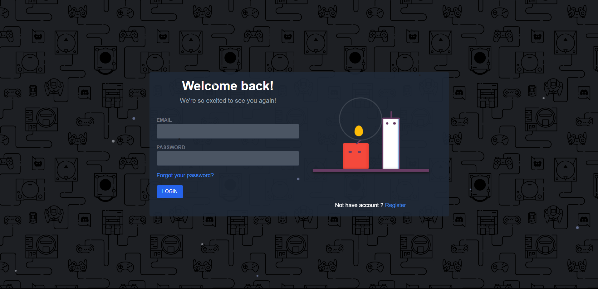
- Sau khi login sẽ chuyển đến index.php

# Remember user
- Click in remember me : hệ thống sẽ tự ghi nhớ user ghi đăng nhập lần tiếp theo

# Register
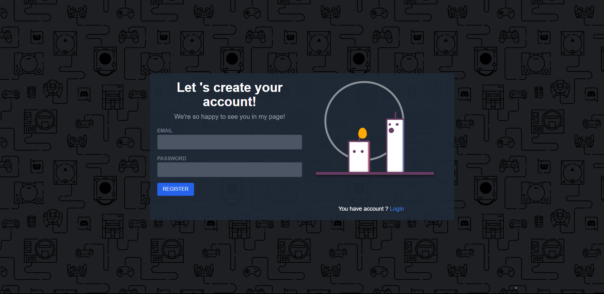
- Sau khi register sẽ chuyển đến login.php để đăng nhập

# Giao diện chính user

1, View post only by user
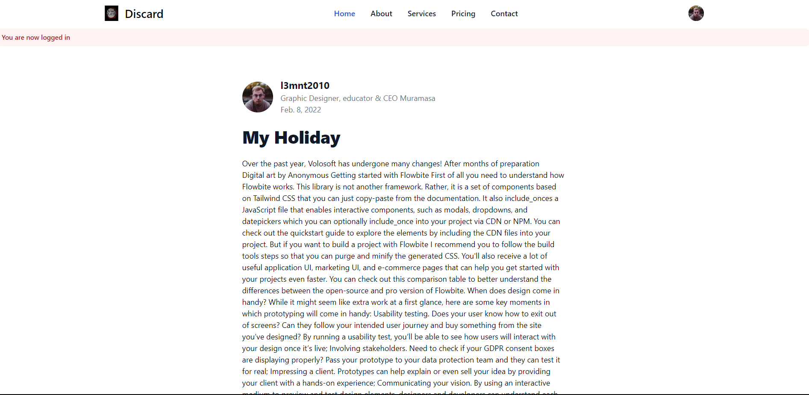

2, User can comment into post
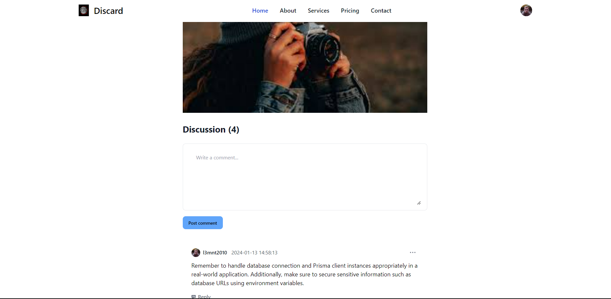
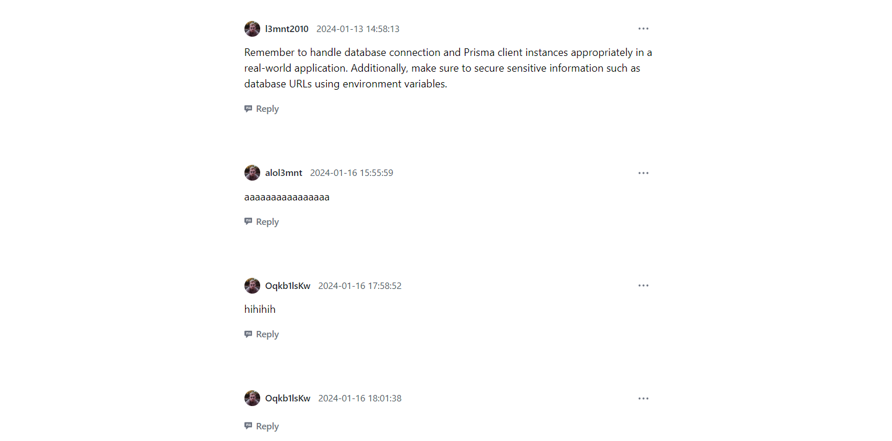

3, User can view all of post by admin and click to read post details
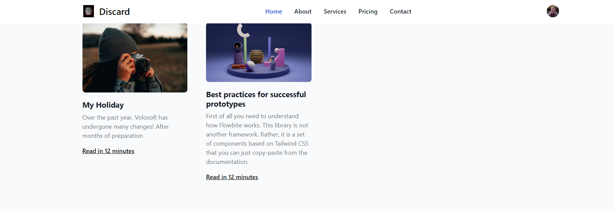

# Giao diện phụ guest
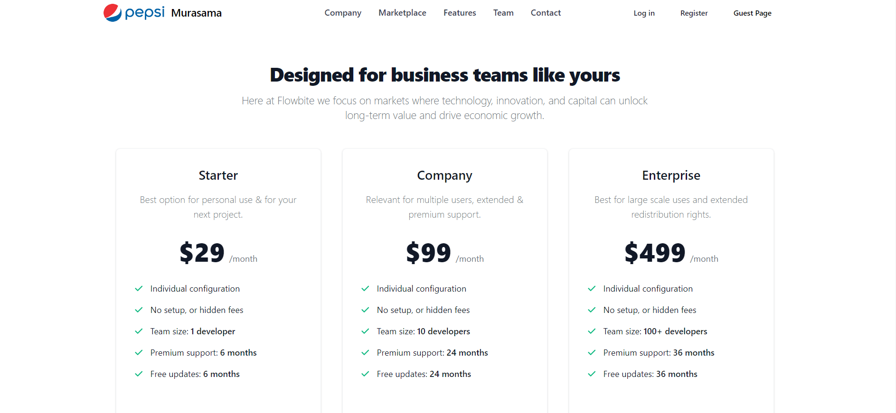

# NavBar
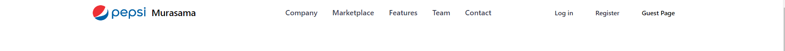

# Menu user when click avatar option
If your role is admin, you can see dashboard else you can't
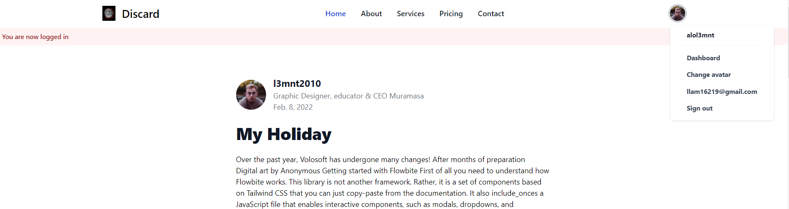
1, Dashboard admin only
  1.1, View main dashboard
  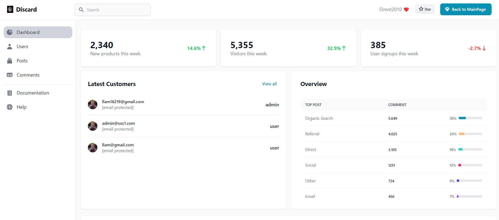
  - Click in button  Back to MainPage to redirect index.php
  - Admin can see all of user
  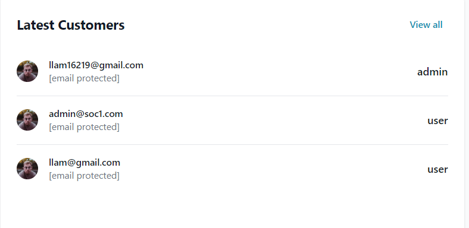

  1.2, Click in User in sidebar admin can see management users table have columns email, role, ...
  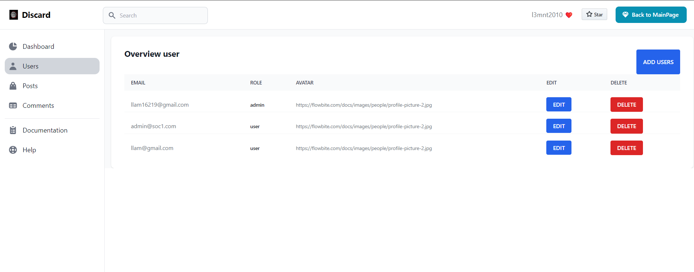
  - Click in button Delete admin can delete this user
  - Click in button Edit admin can edit this user
  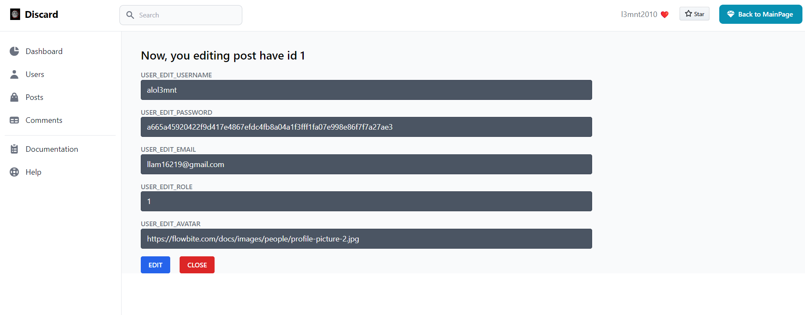
  - Click in button Add user admin can view dialog add new user and click in add to add new user else close dialog
  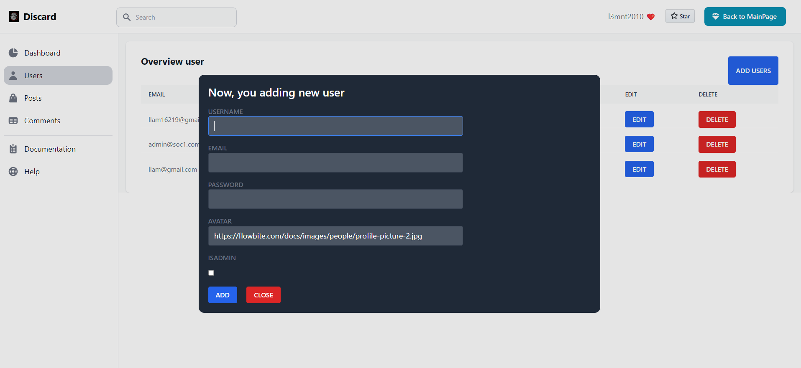

  1.3, Click in Post in sidebar admin can see management posts table have columns id, image, ...
  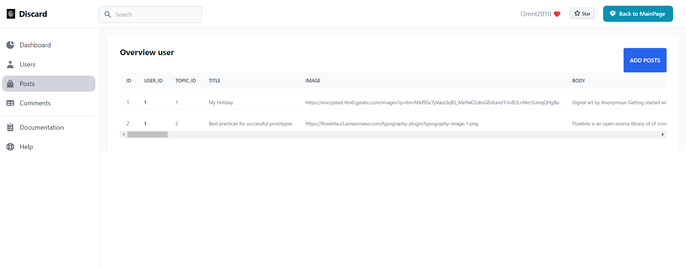
  - Click in button Delete admin can delete this post
  - Click in button Edit admin can edit this post
  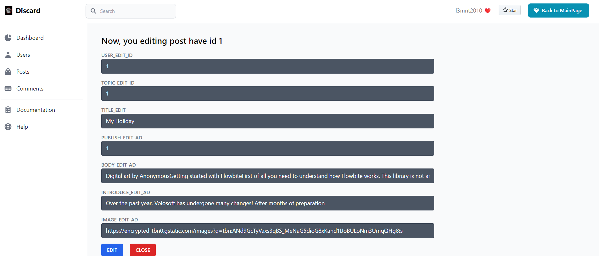
  - Click in button Add post admin can view dialog add new post and click in add to add new post else close dialog
  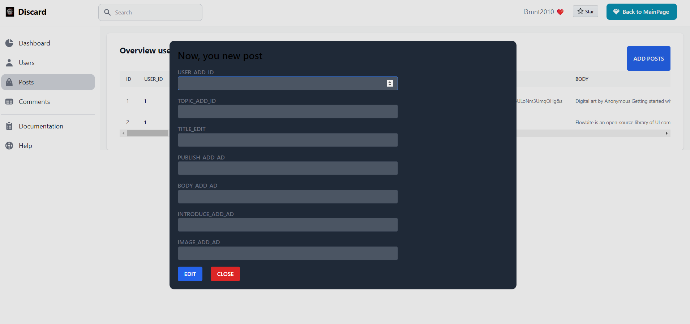
2, Change avatar
   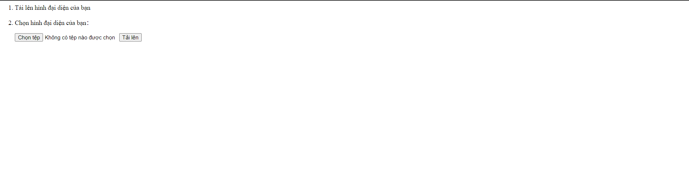
   You can upload file to use this avatar and we resize this avatar to 400x400

## II. Vulnerability in this demo APP

1, Store XSS
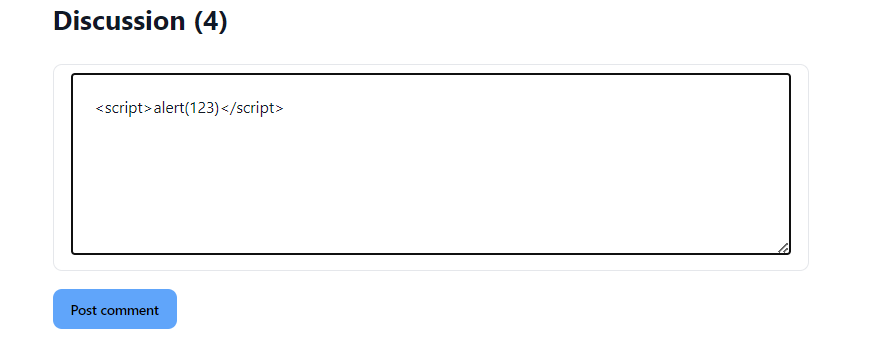
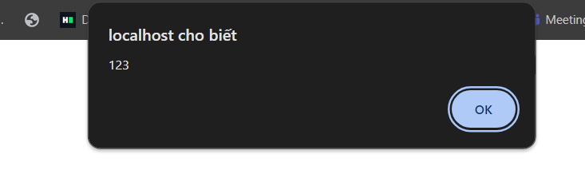
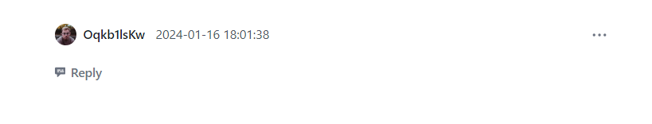
- Where edit and add users or port for admin
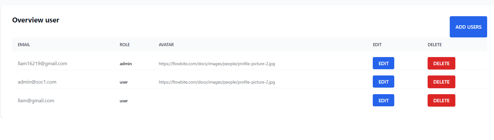

2, Upload file not filter basic
I will update filter for you try hard @@
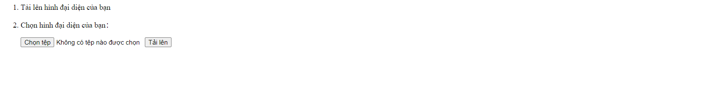
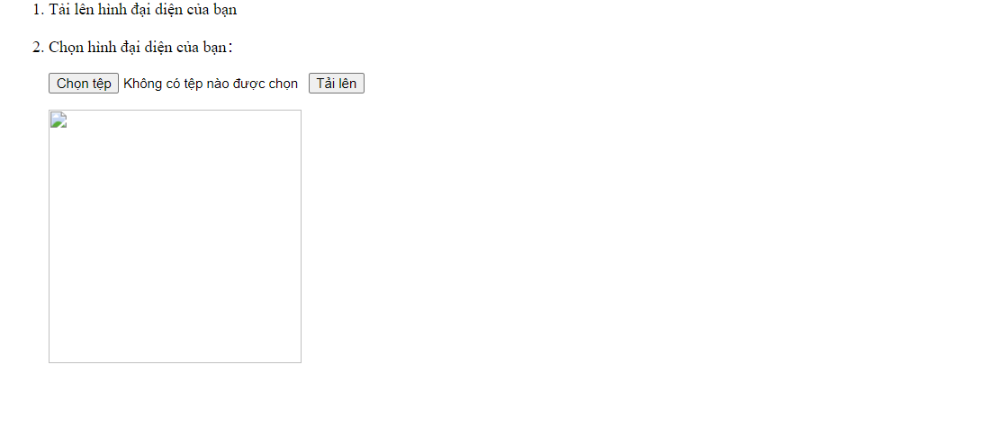
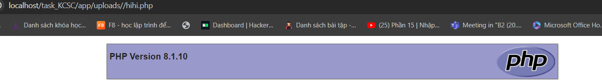 
Xin được giấu thông tin :<

3, Local file inclusion <basic filter>
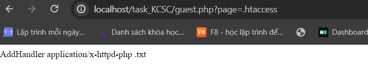

4, Upload file to rewrite .htaccess
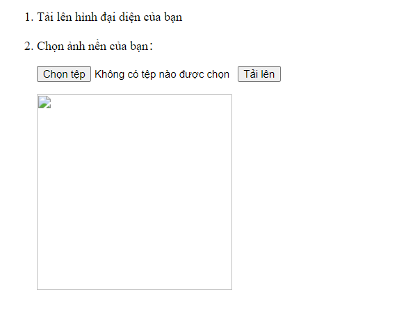
Example : I rewrite .htaccess allow run file txt same php
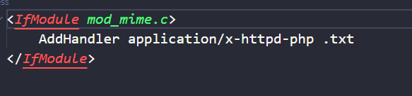

5, Deserialize vulnerabilities
Chức năng remember me chứa lỗ hổng này . Khi remember me set remember_data và khi vào lại thì check cookie xem có không deserialize
- Đang phát triển chức năng ghi logs to RCE<Lấy ý tưởng của KCSC recruite ạ>

6. Blind SQL injection
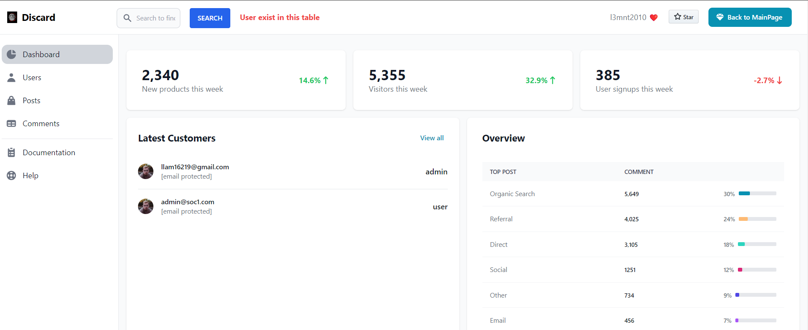
Hihi em không biết nên áp dụng blind sqli kiểu chi trong trường hợp product nên làm kiểu này ạ ^^

7, Cmd injection <đang phát triển> tại không biết nhiều ứng dụng khi dùng exec nên em chưa dùng nhiều :<
Trong main_upload_image để convert size image
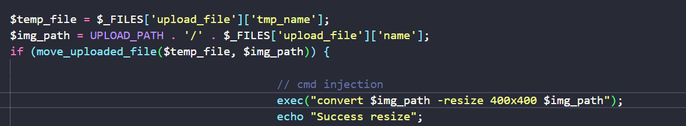
mà tên file mình có thể config được nên có thể Blind Cmd injection mà này em chưa test linux nên chưa thử được ạ :3

8, Disclosure information
- Lộ file .htaccess and /robots.txt ạ:v

